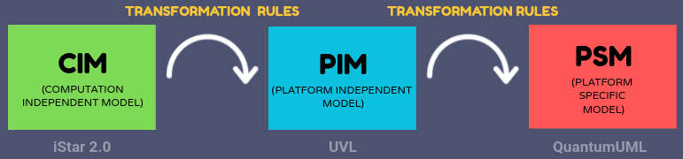
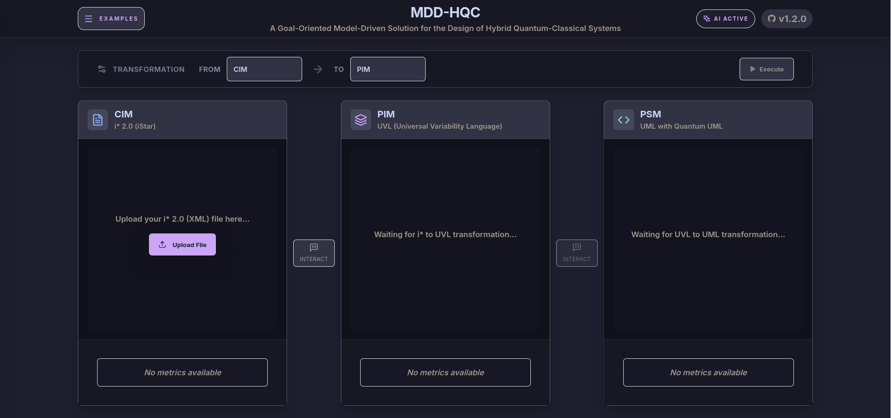
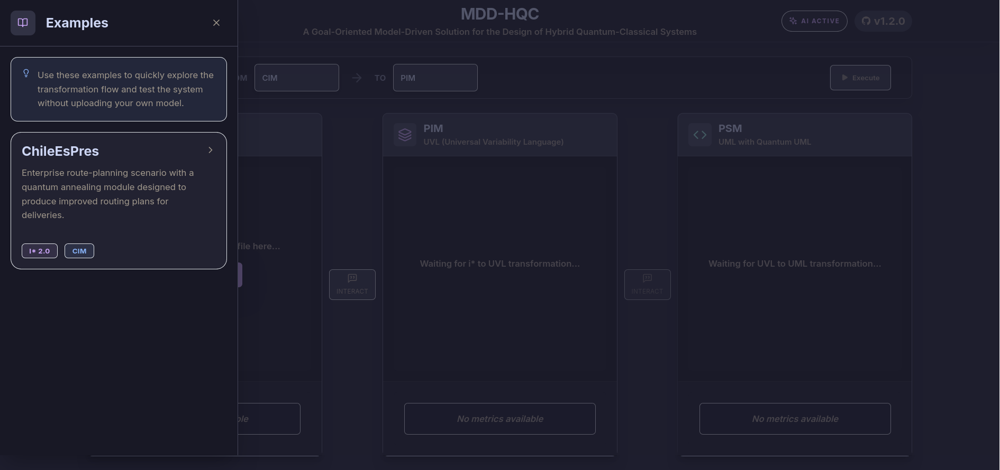
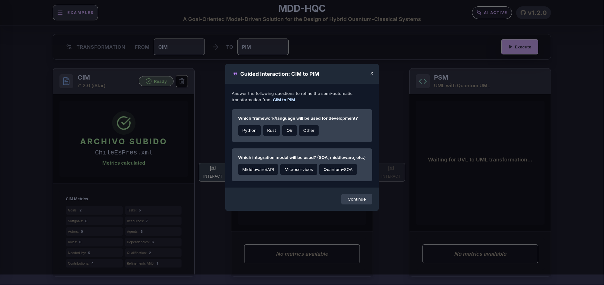
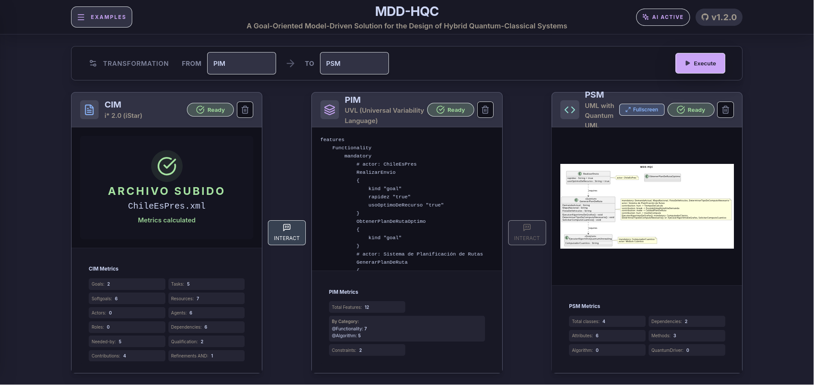

<div align="center">
  <h1><em>MDD-HQC</em></h1>
  <p>
    <a href="https://fastapi.tiangolo.com"></a>
    <a href="https://python.org"></a>
    <a href="https://react.dev"></a>
    <a href="https://developer.mozilla.org/en-US/docs/Web/JavaScript"></a>
    <a href="https://www.docker.com"></a>
    <a href="https://ollama.com"></a>
  </p>
  <p>
    <a href="#need-and-motivation">Need and Motivation</a> ·
    <a href="#what-it-does">What It Does</a> ·
    <a href="#system-features">System Features</a> ·
    <a href="#setup">Setup</a> ·
    <a href="#transformation-pipeline">Transformation Pipeline</a> ·
    <a href="#screenshots">Screenshots</a>
  </p>
</div>

> **Version:** v1.2.0  
> **Status:** Functional Prototype

**MDD-HQC** is a model-driven platform for designing hybrid quantum-classical systems. It transforms **iStar 2.0** models into traceable **UVL** and **UML** artifacts enriched with **QuantumUML** stereotypes, with advisory **LLM support**.

---

### Need and Motivation

**Hybrid quantum-classical (HQC) systems** combine classical and quantum components, using each paradigm where it offers the greatest benefit.

The main challenge is one of **design**: deciding **when**, **where**, and **how** quantum modules should be integrated into classical systems. These decisions are still expert-dependent and weakly traceable from early requirements to architectural decisions.

Without a structured process, hybrid solutions are harder to **justify**, **evaluate**, and **maintain**.

---

### What It Does

MDD-HQC supports HQC design through a **model-driven flow** from **CIM** to **PIM** and **PSM**.

Starting from **iStar 2.0** goal models, the platform derives traceable **UVL** and **UML** artifacts enriched with **QuantumUML** stereotypes. Each level constrains the next one, narrowing the space of possible solutions and strengthening **vertical traceability**.

**LLM support** helps identify **information gaps**, **ambiguities**, or **misplaced elements** during model refinement. It is **strictly advisory** and never makes decisions on behalf of the user.

---

### System Features

The following table summarizes the main capabilities considered in the proposed system.

> Status legend: ⬤ implemented, ◐ partial, ◯ not implemented.

| Capability | Status |
| --- | --- |
| Goal-oriented capture of HQC requirements | ⬤ |
| Interview-based elicitation for CIM modeling | ◐ |
| CIM model generation and refinement | ◐ |
| CIM to PIM transformation | ⬤ |
| PIM to PSM transformation | ⬤ |
| Bidirectional or multi-entry process support | ◯ |
| Variability management for HQC design | ⬤ |
| Vertical traceability across modeling levels | ⬤ |
| Semantic loss assessment across transformations | ◯ |
| Code-oriented downstream generation | ◯ |
| Project analysis from local folders or GitHub repositories | ◯ |
| AI-assisted interpretation and refinement | ◐ |


---

### Setup

The following must be installed before starting:

* Docker (version 20.10 or higher)
* Docker Compose (version 2.0 or higher)
* Git (for cloning the repository)

> [!NOTE]
> The system is designed to run in **containerized environments** using **Docker Compose** for compatibility and ease of deployment.

#### Using Docker Compose

1. **Clone the repository:**
   ```bash
   git clone git@github.com:JessusTM/MDD-HQC.git
   cd MDD-HQC
   ```

2. **Build and start the services:**
   ```bash
   docker compose up --build
   ```

   This command builds the backend and frontend images and starts both services.

3. **Access the application:**
   * **Frontend:** [http://localhost:3000](http://localhost:3000)
   * **Backend API:** [http://localhost:8000](http://localhost:8000)
   * **API Documentation (Swagger):** [http://localhost:8000/docs](http://localhost:8000/docs)

4. **Stop the services:**
   ```bash
   docker compose down
   ```

> [!CAUTION]
> Ensure that ports 3000 and 8000 are available on the system before running the containers. If these ports are in use, they can be modified in the `docker-compose.yml` file.

---

### Transformation Pipeline

The system implements a **three-level transformation flow**:

1. **CIM (Computation Independent Model)**: Computation-independent model based on iStar 2.0
2. **PIM (Platform Independent Model)**: Platform-independent model using UVL (Universal Variability Language)
3. **PSM (Platform Specific Model)**: Platform-dependent model with UML artifacts enriched with QuantumUML stereotypes

<p align="center">
  
</p>

Each transformation maintains **traceability** between levels, allowing elements to be followed from the business model to the platform-specific implementation.

---

### Screenshots

<table>
  <tr>
    <td width="50%" align="center">
      
      <br>
      <sub>Main interface</sub>
    </td>
    <td width="50%" align="center">
      
      <br>
      <sub>Embedded examples panel</sub>
    </td>
  </tr>
  <tr>
    <td width="50%" align="center">
      
      <br>
      <sub>Guided interaction</sub>
    </td>
    <td width="50%" align="center">
      
      <br>
      <sub>Transformation results</sub>
    </td>
  </tr>
</table>
