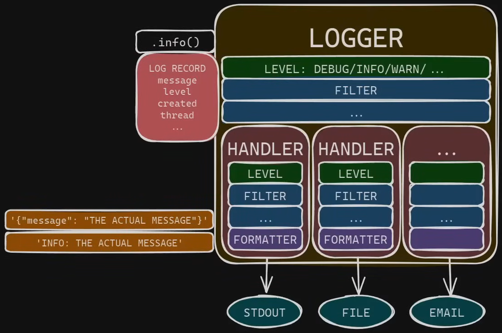

# Replicable Guide to Python Logging 

A logging event conceptually follows this path:



##### 1) Logger
Application code emits events via a named logger (`debug/info/warning/error/exception`). The logger is typically obtained with `logging.getLogger(__name__)`, so the logger name reflects the module (e.g., `app.services.xml_service`). That name matters because it enables hierarchy, subsystem-level filtering, and consistent propagation rules.

In practice, a well-instrumented module starts like this:

```python
import logging

logger = logging.getLogger(__name__)
````

Then the module emits logs with an appropriate severity:

```python
logger.debug("Index built: elements=%s", total_elements)
logger.info("Transformation completed: input=%s", input_path)
logger.warning("Invalid input: extension=%s", extension)
logger.error("XML parsing failed: path=%s", path, exc_info=True)
```

##### 2) LogRecord

Each logging call creates a `LogRecord`: an object that holds the message and useful technical metadata, such as:

* `levelname` / `levelno` (severity)
* `created` (timestamp)
* `name` (logger name)
* `module`, `funcName`, `lineno`, `pathname` (source location)
* `process` / `threadName` (execution context)
* `exc_info` / `stack_info` (exception and stack trace details)

The key point is that at this stage there is no final “text line” yet—there is a rich object that formatters will later turn into text or JSON.

To understand what a `LogRecord` provides, note that format strings reference record attributes by name. For example:

```text
%(asctime)s [%(levelname)s] %(name)s (%(module)s:%(lineno)d) - %(message)s
```

This pulls values from `LogRecord` like `levelname`, `name`, `module`, `lineno`, and the rendered message.

##### 3) Filters (optional)

A filter is a piece of logic that decides whether a `LogRecord` should continue through the pipeline (accepted) or be dropped (rejected). Practically, it acts as a gate that returns `True` / `False` (and in some designs can also modify the record before it continues).

Filters commonly exist in two places:

* **Logger-level filters**: evaluated “upstream”. If a logger filter rejects a record, it is dropped entirely (no handlers, no propagation).
* **Handler-level filters**: evaluated per destination. If a handler filter rejects a record, that handler does not emit it, but other handlers still can.

Filters are useful for more nuanced routing than “minimum level” alone, such as:

* censoring sensitive data before formatting,
* preventing duplicates (e.g., stdout only DEBUG/INFO and stderr only WARNING+),
* implementing rule-based acceptance that a single threshold cannot express.

Example filter (conceptual) to allow only `< WARNING`:

```python
import logging

class BelowWarningFilter(logging.Filter):
    def filter(self, record: logging.LogRecord) -> bool:
        return record.levelno < logging.WARNING
```

##### 4) Handlers

Handlers define destinations. By default, a `LogRecord` does not “choose a single handler”. If a logger (commonly the root logger) has *N* handlers, it attempts to pass the record to each handler.

Whether the record is actually emitted by each destination depends on:

* the **handler level** (threshold),
* the **handler filters**,
* and the **handler formatter** (which turns the record into text/JSON).

So, routing is usually implemented by configuring multiple handlers (stdout, stderr, file) and applying levels/filters per handler.

Important: if one handler drops a record, that does not prevent other handlers from emitting it.

Typical destinations:

* `StreamHandler(sys.stdout)` for “normal” logs
* `StreamHandler(sys.stderr)` for warnings/errors
* `RotatingFileHandler(...)` for persistence

##### 5) Formatter

A formatter defines how a `LogRecord` becomes a string (or serialized JSON). It decides which fields appear: severity, timestamp, logger name, module, line number, etc. Different handlers can use different formatters (e.g., human-readable console + structured file logs).

A console formatter typically prioritizes readability:

```python
"%(asctime)s [%(levelname)s] %(name)s (%(module)s:%(lineno)d) - %(message)s"
```

A file formatter often prioritizes structure for automated parsing.

---
### Hierarchy and propagation (the logger tree)

Loggers form a dot-separated hierarchy. For example:

* `app`
* `app.services`
* `app.services.xml_service`

A child logger can propagate records to its parent, and ultimately to the root logger. Propagation enables centralized handler configuration and avoids duplicating setup per module.

A simple mental diagram:

```text
root
 └── app
     └── app.services
         └── app.services.xml_service
```

If `app.services.xml_service` emits a record and has no handlers, the record can propagate upward and be handled by root handlers—this is exactly what centralized configuration relies on.

> Note: If a record is rejected by a **logger**, it never reaches handlers nor propagates. If it is rejected by a **handler**, it is only dropped for that destination and can still be emitted by other handlers.

---
### Recommended principles for a professional setup

##### 1) Do not use the root logger directly in application code

Avoid `logging.info(...)` (module-level functions) because they emit events through the logger named `root`. This reduces two core capabilities that make logging valuable in real applications:

* **Subsystem identification and control**: using `logging.info(...)` associates events with `root` (logger name `root`). You lose the benefit of `record.name` reflecting the real module (`app.services.xml_service`, `app.api.metrics`, etc.). Named loggers allow filtering, routing, or level adjustments per component without affecting the entire system.
* **Coherent hierarchical configuration**: `logging` is designed around code emitting from named loggers while configuration (handlers/formatters) lives “above” (root + propagation). If application code logs directly through `root`, hierarchy-based control becomes harder and “who produced this record?” is less precise.

In other words: the root logger is primarily a **configuration point**, while application code should emit through named loggers to preserve context and hierarchical control.

So each module should define:

```python
import logging
logger = logging.getLogger(__name__)
```

This yields consistent logger names and makes subsystem-level filtering feasible.

> Note: “one logger per module” is standard; it is not re-created on each call—loggers are cached by name.

##### 2) Keep handlers on the root logger

For small-to-medium applications, a robust default is:

* avoid handlers on non-root loggers (except when truly necessary),
* attach handlers to the root logger,
* rely on propagation.

Why: once handlers are spread across multiple non-root loggers, subtle misconfigurations appear easily (duplicates, conflicting levels, inconsistent filters). Centralizing handlers on root simplifies reasoning: “events propagate to root; root decides routing”. It also ensures third-party library logs share the same formatting and destinations as application logs.

A common symptom of scattered handler setups is seeing the same message printed 2–3 times. Root-centralized handlers drastically reduce that.

##### 3) Prefer `dictConfig` over `basicConfig` for applications

`basicConfig()` is a convenience function that quickly sets up the root logger (typically a single stream handler and a basic format). It is useful for trivial scripts, but it hides the relationships between handlers, filters, and formatters.

In real applications, once you need multiple destinations (stdout + stderr + file), rotation, duplicate-prevention filters, or different formats (console text + file JSON), `basicConfig()` forces ad-hoc manual patching and becomes hard to maintain. `dictConfig` makes the entire graph explicit and predictable.

A minimal `dictConfig` mental skeleton:

```python
import logging.config

logging.config.dictConfig({
    "version": 1,
    "formatters": {
      "console": {"format": "%(levelname)s %(name)s: %(message)s"}
    },
    "handlers": {
      "stdout": {
        "class": "logging.StreamHandler", 
        "formatter": "console"
      }
    },
    "root": {
      "level": "INFO", 
      "handlers": ["stdout"]
    },
})
```

> Note: `basicConfig()` configures a basic case (usually a single `StreamHandler` to stderr and a simple format) and is not intended to explicitly describe multiple handlers/filters/formatters. `dictConfig`, instead, defines logging declaratively using a dictionary (or JSON/YAML loaded into a dict). Typical blocks: `version` (always `1`), `disable_existing_loggers`, `formatters`, `filters`, `handlers`, `root`, and optionally `loggers` for name-specific rules. This makes it auditable which handlers exist, what they format, and which levels/filters they apply.
>
> Note: even when using `dictConfig`, it is common to keep the configuration in an external file for maintainability: `logging_config.json` or `logging_config.yaml` loaded at application startup. JSON has a built-in parser (`json`); YAML typically requires a dependency (e.g., `pyyaml`). Externalizing the config allows format/handler/level changes without editing code (when the deployment model allows it).

---
### Recommended split: stdout vs stderr without duplicates

A common production pattern:

* stdout: “normal” events (DEBUG/INFO)
* stderr: “abnormal” events (WARNING/ERROR/CRITICAL)

This integrates well with containers and observability pipelines. To avoid duplicates, filters are typically used:

* “below warning” for stdout: allows `< WARNING`
* “warning and above” for stderr: allows `>= WARNING`

Without filters, WARNING+ often appears on both streams.

Conceptual handler snippet:

```python
"handlers": {
  "stdout": {
    "class": "logging.StreamHandler", 
    "filters": ["below_warning"], 
    "stream": "ext://sys.stdout"
  },
  "stderr": {
    "class": "logging.StreamHandler", 
    "filters": ["warning_and_above"]
  }
}
```

---
### File logging with rotation

For disk persistence, rotating handlers are recommended:

* `RotatingFileHandler`: rotate by size
* `TimedRotatingFileHandler`: rotate by time

Rotate-by-size is used to cap disk usage; rotate-by-time is used to partition logs by day/week.

Conceptual rotate-by-size handler:

```python
"file": {
  "class": "logging.handlers.RotatingFileHandler",
  "filename": "logs/app.jsonl",
  "maxBytes": 10485760,
  "backupCount": 5,
  "encoding": "utf-8"
}
```

---
### Recommended persistence format: JSON Lines (`.jsonl`)

Free-form text logs are easy to read but hard to parse reliably when:

* tracebacks span multiple lines,
* messages contain newlines,
* automated analysis is required.

For persistence and analysis, structured JSON is preferred. However, the standard library does not ship with a “ready-made” JSON formatter, so a custom formatter class (subclassing `logging.Formatter`) is commonly implemented to serialize `LogRecord` into JSON using a stable schema (timestamp, level, logger, module, line, message, etc.). This prevents ambiguous/messy file logs and enables consistent ingestion.

Minimal custom JSON formatter (conceptual):

```python
import json
import logging
import datetime as dt

class JSONFormatter(logging.Formatter):
    def format(self, record: logging.LogRecord) -> str:
        payload = {
            "timestamp": dt.datetime.fromtimestamp(record.created, tz=dt.timezone.utc).isoformat(),
            "level": record.levelname,
            "logger": record.name,
            "message": record.getMessage(),
            "module": record.module,
            "line": record.lineno,
        }
        if record.exc_info:
            payload["exc_info"] = self.formatException(record.exc_info)
        return json.dumps(payload, ensure_ascii=False)
```

The most practical file format is **JSON Lines**:

* one event → one JSON object
* one `.jsonl` file → one JSON object per line (each line is valid JSON)

So the whole file is not a single valid JSON document; it is a stream of independent JSON objects. This is ideal for streaming parsers and log ingestion tools.

---
### Errors and Stack Traces

To record an error with tracebacks:

* `logger.error("message", exc_info=True)`, or
* `logger.exception("message")` inside an `except` block

Example:

```python
try:
    parse_xml(path)
except Exception:
    logger.exception("XML parsing failed: path=%s", path)
    raise
```

---
### Performance: QueueHandler and QueueListener

Logging often implies I/O (stdout/stderr, files, network). Under concurrency or high load, that I/O can become visible latency: each request might generate many log events, and if writing them blocks the main thread, response time degrades. In that context, it makes sense to decouple “producing log events” from “writing/dispatching log events”.

A standard approach:

* **`QueueHandler`**: enqueues `LogRecord`s into an in-memory queue quickly (minimizes blocking in the request/worker thread).
* **`QueueListener`**: consumes the queue in a dedicated thread and dispatches records to the real handlers (stdout, stderr, file).

Practically:

* application code still calls `logger.info(...)` as usual,
* the root logger uses a `QueueHandler` as its primary handler,
* the listener performs the heavy I/O work outside the critical path.

This pattern is justified when log volume is high, destinations are slow, or latency impact is observed. For small apps it may be optional; for higher-throughput services it is often a meaningful improvement.

Conceptual config shape:

```python
"handlers": {
  "stdout": {...},
  "stderr": {...},
  "file": {...},
  "queue": {
    "class": "logging.handlers.QueueHandler",
    "handlers": [
      "stdout", 
      "stderr", 
      "file"
    ]
  }
},
"root": {
  "level": "INFO",
  "handlers": ["queue"]
}
```

At startup, the associated listener is started (depending on how it is wired), so the queue is actively drained and dispatched.

---
### Practical level conventions

* DEBUG: internal details (counts, state).
* INFO: key flow events.
* WARNING: invalid inputs, non-fatal unexpected conditions.
* ERROR: operation failures (with traceback when appropriate).
* CRITICAL: severe process/service failures.

---
### Final checklist

A solid, replicable setup typically includes:

* per-module named loggers (`getLogger(__name__)`)
* `dictConfig` as the source of truth
* handlers attached to the root logger
* stdout/stderr split without duplicates using filters
* rotating file persistence (ideally JSONL with a custom formatter)
* log level configurable via environment variables
* errors with `exc_info=True` or `logger.exception`
